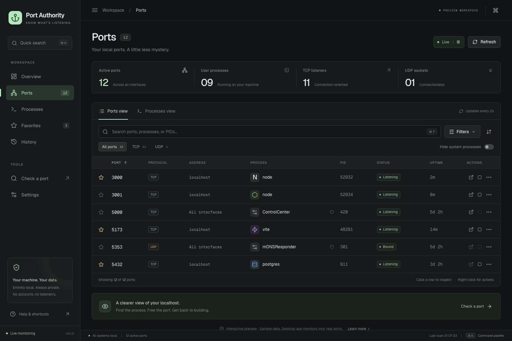

# Port Authority

**Know what’s listening.** A local-first desktop utility for inspecting listening TCP ports, bound UDP sockets, and the processes that own them. Built with Rust, Tauri 2, React, and strict TypeScript.



## Port Timeline

**History** is a local SQLite flight recorder for port ownership. Open **View Timeline** from a port to see claims, releases, restarts, saved process/project metadata, and monitoring gaps. Repeated returns surface persistent ancestors, with explicit process-tree review before stopping anything. History defaults to 30 days and writes only on transitions. [Usage, architecture, and limits](docs/port-timeline.md).

## Run

Requires Node.js 20+ (22 recommended), npm, and Rust. `rust-toolchain.toml` selects Rust 1.95.0. Install the [Tauri platform prerequisites](https://v2.tauri.app/start/prerequisites/) first: Xcode command line tools on macOS, WebKitGTK 4.1 and build tools on Linux, or MSVC build tools and WebView2 on Windows.

```sh
npm ci
npm run desktop
```

The desktop app inspects **real local sockets**. To explore the UI without native dependencies:

```sh
npm run dev
# http://127.0.0.1:1420
```

The browser version is explicitly labeled **Preview workspace**. It uses sample services; killing a sample process only changes the preview. Browser actions still open the selected localhost URL when requested. Preview history is sample data, separate from native SQLite history. Native copy actions use the [Tauri clipboard plugin](https://v2.tauri.app/plugin/clipboard/) with write-only permission.

For a desktop package:

```sh
npm run desktop:build
# macOS app: src-tauri/target/release/bundle/macos/Port Authority.app
```

A locally verified, unsigned debug app is also available after:

```sh
npm run tauri build -- --debug --bundles app
```

Quit any separately started Vite server on port 1420 before running `npm run desktop`, which starts its own frontend server.

## Project Awareness

Ports and processes now show the project behind each service. The Rust resolver uses working directories, nearby manifests, executable paths, and parent metadata; it enriches the UI asynchronously without holding up socket scans. Open **Projects** to group running services, pin workspaces, revisit recent projects, and launch your preferred editor or terminal.

Project names, repository paths, and `~/…` paths are searchable. Project details and actions are shared by the ports table, process drawer, context menu, command palette, and Conflict Autopilot. Configure applications in **Settings → Project applications**.

See [Project Awareness](docs/project-awareness.md) for resolution rules, privacy, Git caching, platform actions, and limitations.

## Conflict Autopilot

Opt-in bash/zsh integration detects failed commands with occupied-port errors and offers guarded **Kill & Retry**, **Use another port**, **Inspect**, and captured **Restart Owner** actions. Open **Autopilot** in the desktop sidebar to enable it and copy the setup for your shell. No startup files are edited.

See [Conflict Autopilot](docs/conflict-autopilot.md) for setup, safety policy, supported command adapters, and lifecycle limits. The browser preview includes labeled development-server, infrastructure, and force-escalation simulations.

## What works

- Native IPv4/IPv6 socket discovery, process/PID association, and process details.
- Two-second live refresh; pause, manual refresh, and configurable intervals.
- Stable row identities, numeric sorting, instant search, exact `:5173` searches, and protocol/interface/owner filters.
- Individual port and grouped process views; process details drawer and keyboard-accessible context menus.
- Graceful termination on Unix; force termination with mandatory confirmation. Privileged, different-user, critical, and application-owned processes are protected.
- Browser launch for common HTTP development ports, explicit confirmation for other ports, and copy actions.
- Persistent favorites, including inactive watched ports; port availability lookup.
- Overview, bounded local history, settings, and command palette.
- Locally bundled fonts. No analytics, telemetry, cloud service, account, or remote requests on startup.

| Shortcut | Action |
| --- | --- |
| Cmd/Ctrl K | Command palette |
| Cmd/Ctrl F | Filter ports |
| Cmd/Ctrl R | Refresh |
| Cmd/Ctrl , | Settings |
| Escape | Close drawer or dialog |

## Architecture

```text
src/
  components/        Table, drawer, dialogs, navigation, and secondary views
  hooks/             Monitoring, application state, validated persistence
  lib/               Typed bridge, pure filtering/reconciliation, preview fixtures
  features/projects/ Shared identities, details, actions, grouped workspace
  features/timeline/ Timeline, ownership sessions, recurrence explanation, retention
src-tauri/src/
  ports/             Core scanner, serializable socket/process models
  process/           Cached metadata policy and guarded process controller
  platform/          Native discovery adapter, Unix and Windows termination
  commands/          Thin, asynchronous Tauri command adapters
  autopilot/         Conflict detection, classification, capture, recovery, and private IPC
  projects/          Resolver, bounded manifests, Git metadata, cache, and application actions
  timeline/          Reconciliation, correlation, ancestry, SQLite, and monitoring sessions
  recovery/          Launch contexts, recipes, ancestry correlation, safe restart, detached output
shell/               Optional bash/zsh integration
```

The discovery and control modules do not depend on Tauri. The desktop commands move blocking work to worker threads. Socket discovery uses [netstat2](https://docs.rs/netstat2/0.11.2/netstat2/); process inspection uses [sysinfo](https://docs.rs/sysinfo/0.33.1/sysinfo/). Socket discovery spawns no shell commands. Project enrichment separately uses bounded local Git subprocesses with explicit argument vectors. macOS uses libproc, Linux uses netlink/procfs, and Windows uses IP Helper APIs through the shared socket adapter. Platform-specific process control stays in `platform/`.

A retained `sysinfo::System` provides CPU sampling across scans. Command, executable, and working-directory metadata refresh with each scan so process changes cannot retain a stale project association. The scanner refreshes relevant and cached process IDs, removes dead processes, and caps its cache at 4,096 entries. Scans never overlap in the UI. Full bounded snapshots cross IPC; the frontend reconciles unchanged row objects rather than resetting the table. Delta-only IPC and virtualization are future optimizations if profiling requires them.

Settings and favorites use validated webview storage. Port Timeline uses a local SQLite database with 30-day retention by default, configurable from 24 hours to forever. Event snapshots retain process commands and project metadata; disabling recording preserves saved history. Clear History removes retained events and monitoring sessions. CPU is initially zero until a second scan; process uptime is the process age, not socket age.

## Safety and platform behavior

Before termination, the backend independently re-reads the process, validates its start time against the selected PID, checks ownership, and rejects critical services and Port Authority itself. The frontend always confirms force kill; graceful confirmation is configurable. There is no automatic privilege escalation. Termination may be asynchronous; the next scan reflects whether the service actually exited. A supervisor may relaunch it.

| Platform | Implementation | Verification in this workspace |
| --- | --- | --- |
| macOS | Native sockets and metadata; SIGTERM / SIGKILL | Compiled, tested against real TCP/UDP sockets and disposable child processes; app bundled and launched |
| Linux | Native socket adapter and procfs; SIGTERM / SIGKILL | Implemented; CI workflow provided, not executed here |
| Windows | Native socket adapter; handle-based force termination with creation-time validation | Implemented; CI workflow provided, not executed here |

Windows has no universal graceful signal for arbitrary processes. Normal Kill returns a useful explanation; **Force Kill** uses `OpenProcess` / `TerminateProcess` and never silently substitutes for graceful termination. Missing process information is omitted, with an explanation in the drawer. Unknown-owner sockets remain visible and cannot be terminated.

“Available” means no matching socket was visible in the most recent successful scan. It is not a reservation or a guarantee that an immediate bind will succeed; OS permissions can limit visibility. Failed scans never produce an availability claim. Paused lookups explicitly refer to the last scan.

Command Recovery enables Restart only when a complete runtime context or explicit project recovery command is available. It verifies the launch tree and all affected ports before reporting success. Unknown commands, unavailable environments, Docker proxies, and changed identities remain unavailable. Startup registration is visibly unavailable; System theme currently uses the dark appearance. The initial package is unsigned/unnotarized. There is no general-purpose CLI; the executable provides internal shell-capture and detached-supervisor entry points.

## Command Recovery

Enable Conflict Autopilot and source its setup command in bash or zsh. The optional wrappers now observe successful starts as well as failed port binds:

```sh
cd ~/Code/shipwreck
npm run dev
# Or capture an external executable explicitly:
pa cargo run
```

Inspect the listener to see **Launch**: the original argument vector, working directory, source, launch root, and redacted environment. **Restart** gracefully stops the verified launch tree; **Kill & Relaunch** explicitly force stops it. Both check that every affected TCP port is released, run the original command from the original directory, and verify ownership across several scans before reporting success. Package managers stay distinct. Metadata reconstruction is labelled; missing prerequisites fail before termination.

**Set / Edit Recovery Command** stores a project recipe with an executable, literal arguments (one per line), and absolute directory. Recipes explicitly use the desktop app’s environment and act as a fallback; a complete newly observed terminal launch keeps its original command. **Test Recovery Command** starts the recipe and verifies the selected port only when the project and port are idle; it never stops an existing process. A successful test leaves the service running. Use Restart to replace an active launch.

Launch metadata and recipes share `port-timeline.sqlite`. Runtime environments are held in memory and transferred to a detached supervisor through a pipe; secret values are not persisted. After reopening the app, saved contexts explain their origin but remain unavailable when their runtime environment is missing. A project recipe or a new observed launch restores deterministic recovery. Up to 200 recent context records and output artifacts are retained. Output is a bounded 32 KiB, redacted, local file with private permissions; **View Output** and **Inspect Process** remain available when verification fails. Closing the window or desktop does not stop relaunched services.

Timeline snapshots include launch context and identify launches made by Port Authority. Autopilot uses the same structured spawning and recovery root; captured owners are stopped as a tree and can be restarted through Command Recovery. No keystroke logging, terminal transcript capture, telemetry, or cloud history is added.

Initial adapters cover npm, pnpm, yarn, bun, cargo, and Python. Rewritten process titles are not parsed as shell commands. Generic metadata remains inspectable but cannot enable restart without enough evidence or a recipe. Shell syntax is only executed when an explicit shell executable and its arguments were captured/configured; aliases, functions, shell startup state, arbitrary pipelines outside the wrapper, daemonizing supervisors, Docker recovery, and project-wide task orchestration are not inferred. macOS is verified locally; Linux/Windows native behavior still depends on their process-inspection and termination support.

## Verify

```sh
npm run build
npm run lint
npm test
npm run test:shell
npx playwright install chromium
npm run test:e2e
cargo fmt --manifest-path src-tauri/Cargo.toml --check
cargo clippy --manifest-path src-tauri/Cargo.toml --all-targets -- -D warnings
cargo test --manifest-path src-tauri/Cargo.toml
```

Tests cover query validation, search, filtering, recognition, sorting, stable reconciliation, persistence validation, primary browser flows, clipboard and browser actions, scan failure handling, actual socket discovery, PID identity guards, critical-process protection, and graceful/force termination of test-owned children. The GitHub Actions workflow defines frontend checks and a three-platform Rust matrix.

## License

[MIT NON-AI License](LICENSE). This custom, source-available license permits use, modification, and redistribution subject to its terms, but **prohibits all AI/ML use of the code**, including training, inference, AI integrations, and supplying the code to AI coding tools, unless separately authorized in writing by the applicable copyright holder(s). It is not the standard MIT License or an OSI-approved open-source license.

Third-party components and assets retain their own licenses. Previously granted licenses are not retroactively revoked. See the license file for the full terms.

## House Edge browser analytics

The browser version includes House Edge page/view tracking, anonymous sessions, errors, and Web Vitals. Native Tauri sessions are always excluded, even when analytics environment variables are set. Named views are mapped to fixed paths; project names, file contents, and search text are not used as page names.

Create a House Edge project with key `port-authority` and allow this site's exact origin. Set `VITE_HOUSE_EDGE_KEY` to its **browser ingestion key** and `VITE_HOUSE_EDGE_ENDPOINT` to your collector URL ending in `/api/collect`, using `.env.local` or your build environment. `.env.example` lists the settings. Rebuild and redeploy the browser version, then check Live Activity for `page_view` and `session_start` after about five seconds.

Tracking is off when the key or endpoint is missing, and development requires `VITE_HOUSE_EDGE_TRACK_DEVELOPMENT=true`. Do Not Track is respected. The SDK is installed from the checked-in `vendor/house-edge-analytics-0.1.1.tgz`, so independent builds need no sibling House Edge checkout. Commit the tarball with its package manifest and lockfile.
