## Application-Specific Context

This copy of the ecosystem documentation belongs to **Port Authority**.

Its primary ecosystem role is:

> Local port, process, and project runtime manager

Primary integrations:

> Pit Boss, Black Box, House Edge, local system APIs

# Rippley Labs Ecosystem

> The detailed architecture map for Rippley Labs.
>
> Update this document whenever an application's name, responsibility, data
> ownership, integration, or deployment changes.

## System Overview

Rippley Labs is a collection of independently useful applications connected by
three central products:

- **Shipwreck:** discovery, navigation, and launching
- **Black Box:** events, workflows, and cross-app orchestration
- **House Edge:** analytics, telemetry, and reporting

Applications remain independently deployable and retain ownership of their
domain data.

## Architecture Diagram

```mermaid
flowchart TB
    User([User])

    Shipwreck["Shipwreck<br/>Portal & Launcher"]
    BlackBox["Black Box<br/>Integration & Orchestration"]
    HouseEdge["House Edge<br/>Analytics Platform"]

    subgraph Productivity["Productivity & Work"]
        Deck["Deck"]
        RunningTab["Running Tab"]
    end

    subgraph DeveloperTools["Developer Tools"]
        RepoReaper["Repo Reaper"]
        PortAuthority["Port Authority"]
        EnvReaper["Env Reaper"]
        PitBoss["Pit Boss"]
    end

    subgraph ContentUtilities["Content, AI & Utilities"]
        ReadmeRoulette["README Roulette"]
        SaveScum["Save Scum"]
        StackedDeck["Stacked Deck"]
        Diffusion["Diffusion"]
    end

    subgraph LearningGames["Learning & Games"]
        AlgebraQuest["Algebra Quest"]
        SudoSurvive["Sudo Survive"]
    end

    User --> Shipwreck

    Shipwreck --> Deck
    Shipwreck --> RunningTab
    Shipwreck --> RepoReaper
    Shipwreck --> PortAuthority
    Shipwreck --> EnvReaper
    Shipwreck --> PitBoss
    Shipwreck --> ReadmeRoulette
    Shipwreck --> SaveScum
    Shipwreck --> StackedDeck
    Shipwreck --> Diffusion
    Shipwreck --> AlgebraQuest
    Shipwreck --> SudoSurvive

    Deck -- project and task context --> RunningTab
    RepoReaper -- repository findings --> ReadmeRoulette
    PortAuthority -- process status --> PitBoss
    EnvReaper -- environment profiles --> PitBoss

    Deck -- events and commands --> BlackBox
    RunningTab -- events and commands --> BlackBox
    RepoReaper -- events and commands --> BlackBox
    PortAuthority -- events and commands --> BlackBox
    EnvReaper -- events and commands --> BlackBox
    PitBoss -- events and commands --> BlackBox
    ReadmeRoulette -- events and commands --> BlackBox
    SaveScum -- events and commands --> BlackBox
    StackedDeck -- events and commands --> BlackBox
    Diffusion -- events and commands --> BlackBox
    AlgebraQuest -- events and commands --> BlackBox
    SudoSurvive -- events and commands --> BlackBox

    Deck -. telemetry .-> HouseEdge
    RunningTab -. telemetry .-> HouseEdge
    RepoReaper -. telemetry .-> HouseEdge
    PortAuthority -. telemetry .-> HouseEdge
    EnvReaper -. telemetry .-> HouseEdge
    PitBoss -. telemetry .-> HouseEdge
    ReadmeRoulette -. telemetry .-> HouseEdge
    SaveScum -. telemetry .-> HouseEdge
    StackedDeck -. telemetry .-> HouseEdge
    Diffusion -. telemetry .-> HouseEdge
    AlgebraQuest -. telemetry .-> HouseEdge
    SudoSurvive -. telemetry .-> HouseEdge

    BlackBox -. workflow metrics .-> HouseEdge
    Shipwreck -. navigation metrics .-> HouseEdge


```

## Integration Principles

1. Each application owns its domain data.
2. Black Box coordinates work but does not become the universal database.
3. House Edge stores telemetry, not source-of-truth business records.
4. Shipwreck launches products but does not absorb their business logic.
5. Cross-app communication uses APIs, events, commands, and webhooks.
6. Events and public APIs are versioned.
7. Optional integration failures must not corrupt source data.
8. Secrets never travel inside events.
9. Every cross-app request should have a correlation ID.
10. Applications should continue providing core functionality when optional shared services are unavailable.

---

## Known Direct Relationships

| Source          | Target          | Relationship                                             |
| --------------- | --------------- | -------------------------------------------------------- |
| Shipwreck       | Every product   | Discovery, navigation, and launching                     |
| Every product   | House Edge      | Usage, product, revenue, or operational events           |
| Every product   | Black Box       | Domain events, commands, workflows, and automation       |
| Deck            | Running Tab     | Project and task context for time entries                |
| Repo Reaper     | README Roulette | Repository metadata, findings, and recommendations       |
| Port Authority  | Pit Boss        | Running-process and port state                           |
| Env Reaper      | Pit Boss        | Selected environment profiles                            |
| Running Tab     | Stripe          | Payments, saved methods, subscriptions, and invoices     |
| Repo Reaper     | GitHub          | Repository metadata and analysis                         |
| README Roulette | GitHub          | Repository documentation inputs and outputs              |
| Stacked Deck    | AI provider     | Image scanning, identification, and valuation assistance |

---

## Shared Service Boundaries

### Authentication

Shared identity may be used, but individual applications remain responsible for authorization within their own domain.

### Payments

Stripe-related payment state should be synchronized through explicit webhook handling.

Do not treat browser redirects as proof of payment.

### Analytics

Products should emit stable event names and avoid sending sensitive content.

### AI

AI-powered features should support configured providers or bring-your-own-key access where the product requires it.

Model output must be treated as untrusted input and validated before it changes persistent records.

### Deployment

Products may use Azure, Cloudflare, static hosting, desktop packaging, or local execution depending on their actual requirements.

Do not force every product into the same deployment model.

---

## Architecture Decisions

Document major decisions below.

### ADR-001: Applications Retain Domain Ownership

**Decision:** Each application remains the source of truth for its own domain.

**Reason:** This prevents Black Box, Shipwreck, or House Edge from becoming a fragile central monolith.

### ADR-002: Black Box Is the Orchestration Boundary

**Decision:** Cross-app workflows pass through explicit Black Box contracts where orchestration is required.

**Reason:** This prevents applications from accumulating undocumented direct dependencies.

### ADR-003: House Edge Receives Analytics Events

**Decision:** Applications publish product and operational telemetry to House Edge using versioned events.

**Reason:** Metrics can evolve independently from application databases.

---

## Open Architecture Questions

Use this section for questions that are not yet settled.

- Which applications share single sign-on?
- Which applications are local-only?
- Which applications require cloud synchronization?
- What is the canonical user ID format?
- What transport does Black Box use initially?
- Which House Edge events are required versus optional?
- Which integrations need offline queues and retries?
- Which applications receive `oddware.dev` subdomains?
